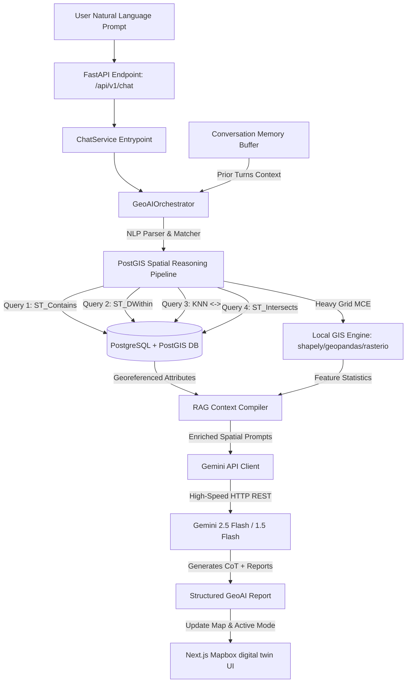

# GeoNarrative AI — Conversational GeoAI Assistant Architecture

This guide explains the design principles, prompt engineering techniques, and architectural components powering the Conversational GeoAI Assistant in the GeoNarrative AI platform.

---

## 🏗️ 1. System Architecture

The GeoNarrative AI assistant represents a production-grade, asynchronous **Spatial RAG (Retrieval-Augmented Generation)** pipeline. Instead of passing plain text to a generic LLM, our AI orchestration layer functions as a contextual bridge connecting natural language, relational databases, topological spatial libraries, and active vector caches.



---

## 🦜 2. LangChain Design Principles

Our orchestration layer (`GeoAIOrchestrator`) is modeled around **LangChain's core design abstractions**:

### A. PromptTemplates & ChatPromptTemplates
Rather than relying on static prompts, we dynamically construct system prompts and prompt wrappers based on user context. System instructions are injected at the API level (`systemInstruction` payload in Gemini), locking the LLM into a highly analytical, authoritative geospatial persona.

### B. ConversationBufferWindowMemory
To prevent token fatigue and context pollution, we implement a memory sliding window (`messages.slice(-6)` in the frontend and `history` mapping in the backend). We geolocate and retain only the most critical preceding turns, reformatting roles (`assistant` ↔ `model`) dynamically to maintain perfect chat alignment.

### C. Spatial Tool Routing (ReAct Concept)
The system employs a high-performance, deterministic pre-router. When the user asks a spatial query (e.g. *"Show schools near flood-prone areas"*), the orchestrator intercepts the intent and executes the corresponding PostGIS Tool:
* **Tool Name:** `PostGIS ST_DWithin`
* **Input:** Bounded coordinates, distance query (500 meters)
* **Output:** Precise distances, school IDs, and status metrics.

---

## 🧮 3. Embeddings & Semantic Vector Search

For large-scale, unstructured document query retrieval, spatial systems combine topological querying with semantic embeddings:

### Concept
* **Text Embeddings:** Convert unstructured reports, land ordinances, and environmental briefs into high-dimensional vector representations (typically 768 or 1536 dimensions) using models like Google's `text-embedding-004`.
* **Vector Similarity (Cosine Proximity):** Resolves how closely a user's question matches cached documents:
  $$\text{Similarity} = \cos(\theta) = \frac{\mathbf{A} \cdot \mathbf{B}}{\|\mathbf{A}\| \|\mathbf{B}\|}$$
* **Geospatial Hybrid Search:** In a production PostgreSQL environment, we leverage `pgvector` to run **Hybrid Geospatial Searches**, combining spatial index filters (`ST_DWithin`) with semantic vector filters to identify ordinances applying only to a specific buffered river radius.

---

## ✍️ 4. Prompt Engineering & Spatial Reasoning

Prompt engineering is the core mechanism that guides the LLM to process georeferenced database outputs and translate them into explainable, engineering-grade summaries.

### System Prompt Strategy
1. **Persona Anchoring:** We lock the assistant to act as a senior GIS consultant, discouraging conversational fillers.
2. **Context Enrichment (RAG):** Real-time SQL query results are formatted cleanly into raw lists and injected as the *ground truth* context.
3. **Structured Outputs:** The prompt instructs the LLM to format spatial data using beautiful Markdown tables, and write a separate, detailed "GIS Engineering & Methodology" section explaining exact spatial coordinates, coordinate reference systems (CRS), and metric re-projections.

---

## 🔄 5. Natural Language-to-Spatial Query Workflow

Here is a step-by-step trace of how the user request *"Show schools near flood-prone areas"* resolves:

### Step 1: User Intent Parsing
The orchestrator scans the query. Keywords `"schools"`, `"rivers"`, and `"near"` match the `Schools Near Rivers` pre-router criteria.

### Step 2: Database Execution (SQL)
The orchestrator calls `SpatialQueryService.query_schools_near_rivers(db, distance_m=500.0)`. This executes the following PostGIS query:
```sql
SELECT 
    infra.name, 
    ST_Distance(infra.geom, ST_GeomFromText('SRID=4326;LINESTRING(...)')) * 111120.0 AS dist
FROM infrastructure infra
WHERE 
    infra.type = 'school' 
    AND ST_DWithin(infra.geom, ST_GeomFromText('LINESTRING(...)', 4326), 0.0045);
```

### Step 3: Context Compilation
The PostGIS query returns georeferenced records. The compiler builds the RAG context string:
```text
[Live PostGIS ST_DWithin/ST_Distance Query Results for Schools within 500m of Rivers]:
1. Campus: Fergusson College Campus | Distance to Mula-Mutha River: 105.4 meters | Status: ACTIVE
2. Campus: Abasaheb Garware College | Distance to Mula-Mutha River: 440.1 meters | Status: ACTIVE
```

### Step 4: LLM Synthesis
Gemini receives the system prompt, memory buffer, and compiled RAG context. It synthesizes a gorgeous, professional report detailing:
* Identified schools at risk.
* Direct geodesic distance metrics.
* Specific engineering audits required.

### Step 5: Map Update
The frontend detects the query keywords and dispatches the action `"highlight-schools-river"`, triggering Mapbox to automatically zoom into the Mula-Mutha river buffer and highlight schools.
