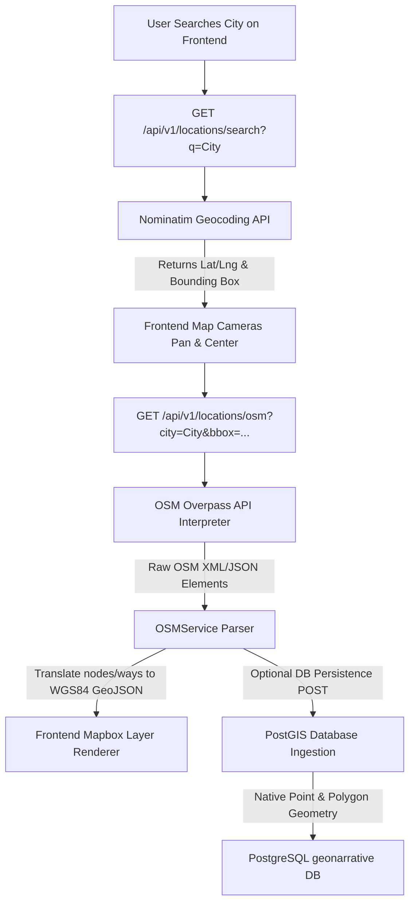

# 🗺️ Dynamic Location Intelligence Architecture

GeoNarrative AI is equipped with a real-time, global geospatial data extraction and geocoding pipeline. When a user searches for any city (e.g., *"Pune"*, *"Mumbai"*, *"London"*), the system dynamically queries global open spatial databases, downloads structural vectors, converts them to high-performance GeoJSON, maps them to Mapbox layers, and persists them inside our spatial PostGIS database.



---

## 🧭 Spatial Data Pipeline Components

### 1. Dynamic Geocoding & Reverse Geocoding
* **Geocoding:** Translates natural language addresses (e.g. `"Pune"`) into coordinates (`[73.8567, 18.5204]`) and spatial boundary extents (Bounding Box). We implement this using the **OSM Nominatim API**.
* **Reverse Geocoding:** Translates coordinate pairs back into structured administrative names.

### 2. OSM Overpass API & Query Language (Overpass QL)
We use the **Overpass API**, a read-only API that serves custom-selected parts of the OSM map data. We construct optimized bounding box queries:
```overpass
[out:json][timeout:25];
(
  way["highway"](18.45,73.75,18.55,73.95);
  node["amenity"="hospital"](18.45,73.75,18.55,73.95);
);
out body geom;
```

### 3. Spatial Parsing Engine (`osm_service.py`)
Converts raw OSM topological elements into standardized RFC 7946 GeoJSON:
* **Nodes (Points):** Translated directly to GeoJSON Point features (e.g., Hospitals, Schools).
* **Ways (Paths & Polygons):** Closed boundaries with building tags become GeoJSON Polygons. Linear features like rivers and highways become GeoJSON LineStrings.
* **Bounding Box Guard:** Restricts the bounding box to a maximum delta of `0.15` degrees to protect public servers and guarantee sub-second API roundtrips.

### 4. Caching & Performance Guard
* To avoid hitting OSM rate limits and to guarantee instant load times, the backend implements **file-based JSON caching** under `backend/app/core/cache/`.
* Subsequent requests for the same city read directly from cached layers.

---

## 💾 PostGIS DB Schema Mapping
When persisting layers into the PostgreSQL database, we use the custom spatial database repository:

| Feature Category | OSM Key/Value | PostGIS Target Table | Geometry Column Type |
| :--- | :--- | :--- | :--- |
| **Hospitals** | `node["amenity"="hospital"]` | `infrastructure` | `POINT` (SRID 4326) |
| **Schools / Shelters** | `node["amenity"="school"]` | `infrastructure` | `POINT` (SRID 4326) |
| **Rivers** | `way["waterway"="river"]` | `flood_zones` (WKT representation) | `MULTIPOLYGON` (SRID 4326) |
| **Infrastructure** | `node["power"="substation"]` | `infrastructure` | `POINT` (SRID 4326) |

---

## 🛠️ Testing Your Ingestion Endpoints

You can trigger and check the spatial pipeline directly via curl or the FastAPI interactive docs:

```bash
# 1. Geocode City and Get Bounding Box
curl "http://localhost:8000/api/v1/locations/search?q=Pune"

# 2. Get Real-Time GeoJSON Vectors of Roads in Pune
curl "http://localhost:8000/api/v1/locations/osm?city=Pune&category=roads&lat_min=18.45&lat_max=18.55&lon_min=73.75&lon_max=73.95"

# 3. Automatically Ingest & Persist Pune Hospitals into PostgreSQL PostGIS
curl -X POST "http://localhost:8000/api/v1/locations/osm/persist?city=Pune&category=hospitals&lat_min=18.45&lat_max=18.55&lon_min=73.75&lon_max=73.95"
```
