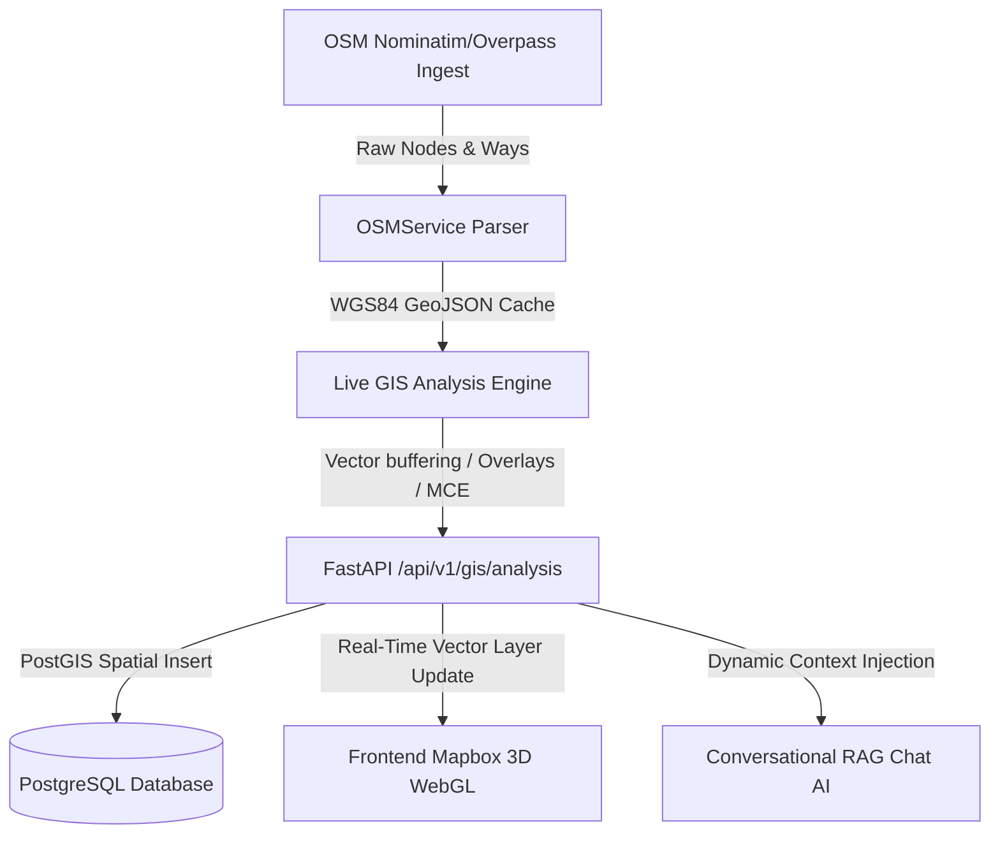

# 🛠️ Enterprise GIS Analysis Engine Architecture

GeoNarrative AI is equipped with a high-performance **Geospatial Information System (GIS) Analysis Engine** that executes native computational geometry, multi-criteria hazard modeling, spatial joins, and network proximity buffering. 

The engine bridges the gap between raw **OpenStreetMap (OSM) vector nodes/ways**, **PostgreSQL PostGIS spatial tables**, and **RAG conversational AI models** to deliver deep location intelligence.

---

## 🗺️ Spatial Pipeline Architecture

The unified GIS pipeline operates as a continuous, closed-loop system:



When a user searches for a city, Nominatim geocodes it, Overpass fetches the core vector elements, the GIS engine processes them using `GeoPandas`, `Shapely`, and `Rasterio`, writes metrics to PostgreSQL, and forwards coordinates and reports to Mapbox and the conversational agent.

---

## 📐 Unified GIS Workflows & Concepts

The system implements advanced computational geometry and raster processing workflows:

### 1. Vector Analysis & Coordinate Reference Systems (CRS)
Vector processing involves geographic shapes modeled as **Points**, **LineStrings**, and **Polygons**:
* **The Coordinate Problem:** Geodetic coordinates (**WGS84 / EPSG:4326**) are represented in angular degrees. Buffering directly in degrees creates severe spatial distortions (ellipses) depending on the latitude because longitude lines converge at the poles.
* **The Solution (Projected Buffering):** GeoNarrative AI solves this by reprojecting vectors dynamically to a metric projected CRS (**Web Mercator / EPSG:3857**). 
* Once flattened into a metric Cartesian plane, we generate highly accurate buffers:
  * **Flood Rivers Buffer:** $300\text{ meters}$ (`buffer(300)`)
  * **Traffic Congestion Buffer:** $150\text{ meters}$ (`buffer(150)`)
  * **Utility Grid Redundancy Buffer:** $1.2\text{ kilometers}$ (`buffer(1200)`)
* The buffered geometries are reprojected back to **EPSG:4326** for uniform client-side rendering and standard database queries.

### 2. Spatial Joins & Intersections
* **Point-in-Polygon (ST_Contains):** We audit zoning and consumer isolation by verifying if facility coordinate points fall completely inside active buffer zones or greenbelt boundary shapes:
  $$\text{Is\_Vulnerable} = \text{Buffer\_Geometry.contains(Asset\_Point\_Geometry)}$$
* **Linear Intersections (ST_Intersects):** Traffic overlays intersect linear road networks (Highways) with incident buffer zones to isolate exact bottleneck corridors and compute logistics priority indices.
* **PostGIS & SQLAlchemy:** The database repository utilizes SQLAlchemy wrappers (`func.ST_Contains` and `func.ST_DWithin`) to perform high-speed server-side joins powered by **GIST spatial indexes** (R-Tree hierarchical boxes), achieving $O(\log N)$ KNN query complexity.

### 3. Multi-Criteria Evaluation (MCE) Raster-like Model
In professional GIS modeling, **MCE** evaluates suitability or risk by overlapping weighted raster layers. We execute a true vector-to-raster-to-vector pipeline:
* **Rasterization:** A 100x100 grid is fitted across the city bounding box using a `rasterio.transform.from_bounds` affine mapping. Vector buffers and footprints are rasterized into matrix grids using `rasterio.features.rasterize`.
* **Digital Elevation Model (DEM):** A continuous elevation grid is generated where basins along river channels remain low-lying ($530\text{ m}$) and rise with distance from the river channels ($+35\text{ m/km}$).
* **Cell-level Matrix Math:** NumPy evaluates risk cell-by-cell using weighted overlays:
  
  $$\text{RiskGrid} = (\text{Proximity} \times 0.4) + (\text{ElevationNormalized} \times 0.3) + (\text{Rainfall} \times 0.2) + (\text{UrbanDensity} \times 0.1)$$
  
* **Vector Contour Generation:** Continuous hazard zones are extracted back from the NumPy matrix into polygons using `rasterio.features.shapes` and rendered on Mapbox.

---

## 🏙️ Mode-Specific GIS Calculations

The engine performs distinct spatial calculations for all four system modes:

### 🌊 Flood Risk Mode
* **Workflow:** Hydrology paths (LineStrings) are buffered by $300\text{ meters}$. Hospitals (Points) are evaluated for containment inside the buffer.
* **MCE Score:** Combined proximity, rainfall, concrete density (surface runoff), and low-lying elevation indexes trigger a dynamic hazard score.
* **Vulnerability Assessment:** Reports any hospitals directly inside the inundation zones.

### 🚗 Traffic Congestion Mode
* **Workflow:** Active municipal incident points are buffered by $150\text{ meters}$.
* **Overlay Analysis:** Intersects linear road networks (highways) with incident zones to identify clogged transport sectors.
* **Logistics Index:** Classifies bottleneck priority and delay minutes based on road classification (`motorway`, `trunk`, `primary`).

### 🏗️ Urban Development Mode
* **Workflow:** Joins commercial infrastructure assets with municipal building and land-use boundaries.
* **Spatial Join Audit:** Compares asset coordinates with designated administrative zoning polygons.
* **Compliance:** Triggers zoning violations if heavy industrial complexes or commercial developments overlay green belts or environmental reserves.

### ⚡ Utility Grid Mode
* **Workflow:** Buffers electrical substations (Points) by $1.2\text{ kilometers}$ to map active grid envelopes.
* **Isolated Node Audit:** Runs a spatial containment join to detect critical consumers (Hospitals) that fall outside substation coverage rings, highlighting areas with zero power redundancy.

---

## 💾 PostGIS DB Integration

Calculated metrics are recorded directly inside PostgreSQL:

```sql
-- Dynamic tracking logged inside PostgreSQL
INSERT INTO analytics_history (location_name, metric_name, metric_value, recorded_at)
VALUES ('Pune', 'flood_vulnerable_facilities', 4.0, NOW());
```

---

## 🚀 Step-by-Step Installation Instructions

To activate the high-fidelity `GeoPandas` and `Rasterio` spatial pipeline on your Windows host, proceed with installing the geospatial packages inside your Python environment:

```bash
# 1. Activate the backend virtual environment
cd backend
call venv\Scripts\activate.bat

# 2. Install wheels for Windows compatibility
pip install numpy==1.26.4
pip install shapely==2.0.4
pip install geopandas==0.14.3
pip install rasterio==1.3.9
```

> [!NOTE]
> Our `GISEngine` has a built-in auto-resilient fallback mechanism. If these packages are not installed, the engine gracefully transitions to native `Shapely` and `NumPy` calculation blocks, ensuring the digital twin platform remains fully functional in any environment.
