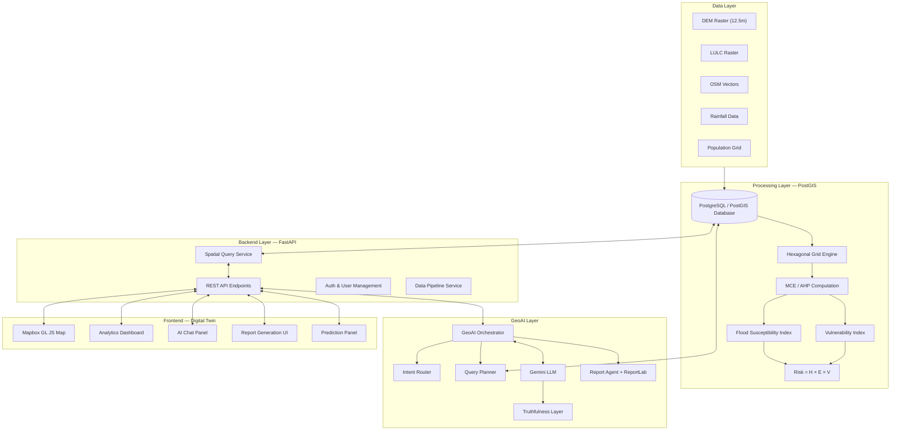
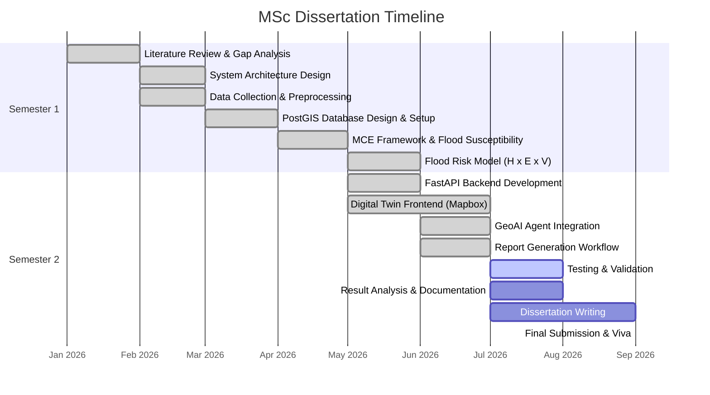

# MSc Dissertation Synopsis

## 1. Title

**GeoNarrative AI: An Agentic GeoAI Digital Twin for Flood Risk Assessment and Spatial Decision Support Using PostGIS, Multi-Criteria Evaluation and Large Language Models**

---

## 2. Background

Urban flooding has emerged as one of the most damaging natural hazards in rapidly growing Indian cities. Pune, located at the confluence of the Mula and Mutha rivers, has experienced severe flood events in recent years — most notably during the 2019 monsoon, which caused widespread damage to infrastructure, displaced thousands of residents, and exposed fundamental weaknesses in the city's disaster preparedness. As urban expansion continues to replace permeable surfaces with impervious built-up areas, the frequency and intensity of pluvial and fluvial flooding are expected to increase further. Effective flood risk management therefore requires spatial tools that can model hazard, quantify exposure, and assess vulnerability across the urban landscape.

Geographic Information Systems (GIS) have long served as the foundation for flood hazard mapping and spatial analysis. Traditional GIS workflows, however, tend to produce static outputs — maps and reports generated at a single point in time that become outdated as the urban fabric changes. These workflows also require specialised expertise in GIS software, making it difficult for urban planners, emergency responders, and policymakers to interact with spatial data directly or ask ad-hoc analytical questions without depending on a trained GIS operator.

The concept of a Digital Twin — a dynamic, data-driven virtual representation of a physical entity — offers a promising alternative. When applied to urban systems, a Digital Twin can continuously reflect changes in land use, building stock, and infrastructure, enabling scenario-based planning and near-real-time situational awareness. However, most urban Digital Twins reported in the literature remain focused on visualisation and monitoring, with limited analytical capability for multi-criteria hazard assessment.

Recent developments in Geospatial Artificial Intelligence (GeoAI) and Large Language Models (LLMs) have opened new possibilities for bridging this gap. An LLM-powered conversational interface can translate natural language queries into structured spatial database operations, enabling non-expert users to interrogate complex geospatial datasets without writing SQL or operating desktop GIS software. This form of conversational spatial intelligence, when combined with a well-structured spatial database and a rigorous risk assessment framework, can make flood risk information more accessible and actionable for a wider range of stakeholders. The present study attempts to bring these elements together into a unified system — combining PostGIS-based spatial analytics, Multi-Criteria Evaluation, a 3D Digital Twin interface, and an agentic GeoAI architecture — for flood risk assessment and decision support in Pune City.

---

## 3. Problem Statement

Despite advances in geospatial technology, flood risk assessment in Indian cities remains largely dependent on static GIS workflows that produce fixed-time outputs. Once a flood hazard map is generated, it does not update automatically when new buildings are constructed, land use changes occur, or drainage patterns shift. This temporal rigidity limits the usefulness of conventional approaches for ongoing urban planning and emergency preparedness.

Furthermore, existing GIS dashboards and web-based mapping platforms typically present pre-computed layers that users can view but cannot interrogate analytically. A planner who wants to know how many hospitals fall within high-risk flood zones, or which road segments are most exposed to riverine flooding, must either possess GIS expertise or request a custom analysis — both of which introduce delays and bottlenecks.

There is also a notable absence of systems that integrate spatial hazard modelling with natural language interaction. While LLMs have been applied in various domains, their use as an interface for querying and reasoning over live geospatial databases remains largely unexplored in the flood risk domain. The research gap, therefore, lies in the lack of an integrated platform that combines dynamic flood risk computation within a spatial database, a Digital Twin visualisation layer, and an AI-driven conversational interface that can translate user questions into spatial queries and return contextualised, evidence-based responses.

---

## 4. Aim

The aim of this research is to design, develop, and evaluate an integrated GeoAI-powered Digital Twin platform that performs multi-criteria flood risk assessment for Pune City using PostGIS-based spatial analytics, and provides an agentic conversational interface through which users can query, explore, and generate reports from the spatial database using natural language — thereby improving the accessibility and responsiveness of flood risk information for spatial decision support.

---

## 5. Objectives

1. **Design** a modular system architecture integrating a PostGIS spatial database, a FastAPI backend, a Mapbox-based Digital Twin frontend, and an LLM-powered GeoAI agent for flood risk assessment and decision support.

2. **Develop** a PostGIS spatial database schema capable of storing, indexing, and querying multi-source geospatial datasets including DEM, LULC, building footprints, road networks, waterways, and rainfall data for the Pune study area.

3. **Implement** a Multi-Criteria Evaluation (MCE) framework using Analytical Hierarchy Process (AHP) weights within PostGIS to compute a Flood Susceptibility Index (FSI) across a hexagonal analytical grid.

4. **Integrate** a UNDRR-aligned composite flood risk model (Risk = Hazard × Exposure × Vulnerability) computed entirely within the spatial database to produce classified risk zones.

5. **Develop** an agentic GeoAI architecture incorporating intent routing, spatial query planning, and LLM-based narrative generation to enable natural language interaction with the flood risk database.

6. **Build** an interactive Digital Twin frontend using Mapbox GL JS that visualises flood susceptibility, risk zones, infrastructure exposure, and vulnerability layers with dynamic layer toggling and spatial querying capabilities.

7. **Implement** an AI-driven report generation workflow that retrieves live spatial data from PostGIS, synthesises it through the LLM, and produces structured PDF intelligence reports.

8. **Evaluate** the system through functional testing, spatial accuracy validation against available flood records, and a usability assessment of the conversational GeoAI interface.

---

## 6. Research Questions

1. How can a PostGIS-based Multi-Criteria Evaluation framework be designed to compute flood susceptibility and composite risk scores entirely within the spatial database, without reliance on external GIS software?

2. To what extent can an LLM-based agentic architecture accurately classify user intent and translate natural language queries into valid PostGIS spatial operations for flood risk analysis?

3. How does the integration of a Digital Twin visualisation layer with a live spatial database improve the accessibility of flood risk information compared to conventional static GIS dashboards?

4. What is the spatial agreement between the MCE-derived flood susceptibility zones and historically documented flood-affected areas in Pune City?

5. How effectively can an AI-driven reporting workflow synthesise live spatial query results into structured, contextualised intelligence reports for decision support?

6. What are the practical limitations and scalability considerations of embedding multi-criteria hazard computation and LLM-based querying within a single integrated platform?

---

## 7. Scope of Study

### Study Area
The study focuses on Pune City, Maharashtra, India — a rapidly urbanising metropolitan area situated at the confluence of the Mula and Mutha rivers. Pune's topography, monsoon-driven rainfall patterns, and ongoing urban expansion make it a representative case for studying urban flood risk in Indian cities. The spatial extent of the study is defined by the Pune municipal boundary.

### Flood Risk Assessment
The study covers flood susceptibility mapping using five criteria (elevation, slope, distance to waterways, land use/land cover, and building density) and composite flood risk assessment following the UNDRR framework (Hazard × Exposure × Vulnerability). The analysis is performed on a 500-metre hexagonal grid using PostGIS spatial functions.

### Spatial Analytics
The platform provides spatial analytics capabilities including feature density computation, proximity analysis, infrastructure exposure assessment, and shelter identification through PostGIS queries exposed via RESTful APIs.

### GeoAI Interaction
The conversational GeoAI component enables users to ask natural language questions about flood risk, infrastructure exposure, and spatial patterns. The system uses intent routing to classify queries and a query planner to execute the appropriate PostGIS operations, with an LLM generating narrative responses grounded in the retrieved spatial data.

### Decision Support
The system supports decision-making through interactive map visualisation, quantitative risk dashboards, and AI-generated PDF reports that combine live spatial metrics with contextual analysis.

### Limitations
- The study relies on openly available datasets (ALOS PALSAR DEM at 12.5 m, Sentinel-2 LULC, OpenStreetMap) and does not use proprietary high-resolution data or field-surveyed ground truth.
- Real-time sensor data (rainfall gauges, IoT water level sensors) is not integrated in the current implementation; the system uses historical and static rainfall data.
- Population data (WorldPop) and NDVI layers are under integration and may not be fully incorporated into the MCE model at the time of submission.
- The LLM component depends on the Gemini API and is subject to the limitations of the model's spatial reasoning capabilities. The system includes a truthfulness layer but cannot guarantee the absence of all LLM-generated inaccuracies.
- Validation is limited to available historical flood records and does not include hydrodynamic simulation or field verification.

## 8. Methodology

The research follows a phased approach, progressing from data acquisition through spatial modelling, system development, and evaluation. Each phase builds upon the outputs of the preceding one. The methodology is described below, followed by a workflow diagram.

### Phase 1: Data Collection

Geospatial datasets are collected from multiple open-access sources. The ALOS PALSAR Digital Elevation Model (12.5 m resolution) is obtained from the Alaska Satellite Facility for terrain analysis. Sentinel-2 imagery processed into Land Use/Land Cover (LULC) classification is sourced from the European Space Agency's Copernicus programme. Vector datasets for building footprints, road networks, waterways, railways, points of interest, and land use polygons are extracted from OpenStreetMap using the Overpass API. Rainfall data is compiled from the India Meteorological Department (IMD) and supplementary open sources. Population density grids are obtained from WorldPop. The study area boundary is defined using the Pune municipal corporation administrative boundary.

### Phase 2: Data Preprocessing

All datasets are reprojected to a common coordinate reference system (WGS 84 / EPSG:4326 for geographic operations, with UTM Zone 43N / EPSG:32643 used for metric computations such as distance and area calculations). Raster datasets (DEM, LULC) are clipped to the study area extent. Vector datasets are cleaned for geometry validity, duplicate removal, and attribute standardisation. Terrain derivatives — slope, aspect, and hillshade — are computed from the DEM raster using PostGIS raster functions (ST_Slope, ST_Aspect, ST_HillShade).

### Phase 3: Spatial Database Creation

A PostGIS-enabled PostgreSQL database is designed to serve as the central spatial data store. All preprocessed datasets are ingested into the database with appropriate spatial indexing (GiST indexes). A 500-metre hexagonal analytical grid is generated using ST_HexagonGrid in UTM projection and transformed back to WGS 84. For each hexagon cell, spatial attributes are computed: building density (count of intersecting buildings), road density, POI density, distance to nearest waterway, distance to nearest road, and distance to nearest railway. These derived attributes are stored in an analytics features table that serves as the foundation for subsequent multi-criteria analysis.

### Phase 4: Multi-Criteria Evaluation

A Multi-Criteria Decision Analysis (MCDA) framework is implemented using the Analytical Hierarchy Process (AHP) to assign relative weights to five flood conditioning factors:

| Factor | Weight | Rationale |
|--------|--------|-----------|
| Elevation | 0.35 | Primary control on gravitational water accumulation |
| Distance to Waterways | 0.25 | Proximity to drainage channels determines fluvial flood exposure |
| Slope | 0.20 | Low slope retards runoff and increases ponding probability |
| LULC | 0.10 | Impervious surfaces increase runoff generation |
| Building Density | 0.10 | High density obstructs drainage and increases vulnerability |

All factor values are normalised to a 0–1 continuous scale using min-max normalisation computed within PostGIS. The Flood Susceptibility Index (FSI) is calculated as a weighted linear combination of the normalised factors.

### Phase 5: Flood Risk Mapping

The FSI provides the Hazard component. Exposure is derived from building density and road density metrics. Vulnerability is decomposed into three sub-indices: building vulnerability (50% weight), infrastructure vulnerability (30% weight), and environmental vulnerability (20% weight). The composite flood risk score is computed using the UNDRR formula: Risk = Hazard × Exposure × Vulnerability. Risk scores are classified into five categories (Very Low to Very High) using statistical quantile classification (NTILE). All computations are performed entirely within PostGIS using SQL, and the resulting flood_risk and vulnerability_index tables are spatially indexed for efficient querying.

### Phase 6: Backend Development

A RESTful API backend is developed using Python FastAPI. The backend provides endpoints for spatial data retrieval (GeoJSON layers), analytics queries (KPIs, risk summaries, exposure assessments), AI chat interaction, report generation, and user management. Asynchronous database operations are implemented using SQLAlchemy with asyncpg. The backend connects to the PostGIS database and serves as the intermediary between the spatial data layer and both the frontend and GeoAI components.

### Phase 7: Digital Twin Development

An interactive Digital Twin frontend is developed using Next.js (React) with TypeScript. Mapbox GL JS is used for map rendering, supporting multiple visualisation layers including flood susceptibility zones, risk classifications, building footprints, road networks, waterways, and heatmaps. The interface includes a sidebar for navigation, layer toggle controls, analytics dashboards with KPI cards and charts, a prediction panel, and a report generation panel. The frontend communicates with the FastAPI backend via REST APIs to retrieve and display live spatial data.

### Phase 8: GeoAI Integration

An agentic GeoAI architecture is implemented with the following components:

- **Intent Router**: Classifies user queries into categories (RiskIntent, ExposureIntent, InfrastructureIntent, ShelterIntent, SpatialSearchIntent, GeneralKnowledge, etc.) using keyword analysis and LLM-based classification.
- **Query Planner**: Maps classified intents to specific PostGIS query execution plans, retrieving relevant spatial data from the database.
- **GeoAI Orchestrator**: Coordinates the workflow — receives the user query, invokes intent classification, executes the spatial query plan, constructs a grounded prompt with retrieved data, and calls the LLM (Google Gemini) to generate a narrative response.
- **Truthfulness Layer**: Instructs the LLM to only report statistics present in the retrieved data context and to explicitly acknowledge when data is insufficient.
- **Report Agent**: Generates structured PDF reports by querying live spatial data, passing it to the LLM for narrative synthesis, and rendering the output using ReportLab.

### Phase 9: Testing and Validation

The system is validated at multiple levels:
- **Functional Testing**: All API endpoints are tested for correct data retrieval and response formatting.
- **Spatial Accuracy**: The MCE-derived flood susceptibility zones are compared against available historical flood records (e.g., documented 2019 Pune flood extents) using spatial overlay analysis (ST_Intersects).
- **GeoAI Accuracy**: A set of test queries is prepared to evaluate the intent router's classification accuracy and the relevance of LLM-generated responses.
- **Usability**: The conversational interface is assessed for its ability to handle representative flood risk queries and return meaningful, grounded responses.

### Phase 10: Result Analysis

The final phase involves analysing the flood risk distribution across Pune City, identifying the most vulnerable zones, quantifying infrastructure exposure, and documenting the system's capabilities and limitations. Results are presented through maps, charts, statistical summaries, and sample AI-generated reports.

### Methodology Workflow Diagram

```mermaid
flowchart TD
    subgraph P1["Phase 1: Data Collection"]
        D1["ALOS PALSAR DEM (12.5m)"]
        D2["Sentinel-2 LULC"]
        D3["OSM Vectors (Buildings, Roads, Waterways)"]
        D4["Rainfall Data (IMD)"]
        D5["WorldPop Population"]
        D6["Study Area Boundary"]
    end

    subgraph P2["Phase 2: Data Preprocessing"]
        PR1["CRS Reprojection (EPSG:4326 / 32643)"]
        PR2["Raster Clipping & Terrain Derivatives"]
        PR3["Vector Cleaning & Standardisation"]
    end

    subgraph P3["Phase 3: Spatial Database"]
        DB1["PostGIS Database Design"]
        DB2["Data Ingestion & Spatial Indexing"]
        DB3["Hexagonal Grid Generation (500m)"]
        DB4["Feature Density & Distance Computation"]
    end

    subgraph P4["Phase 4: Multi-Criteria Evaluation"]
        MC1["AHP Weight Assignment"]
        MC2["Min-Max Normalisation"]
        MC3["Flood Susceptibility Index (FSI)"]
    end

    subgraph P5["Phase 5: Flood Risk Mapping"]
        FR1["Exposure Calculation"]
        FR2["Vulnerability Index (3 Sub-indices)"]
        FR3["Composite Risk: H × E × V"]
        FR4["Quantile Classification"]
    end

    subgraph P6["Phase 6: Backend"]
        BE1["FastAPI REST APIs"]
        BE2["Spatial Query Endpoints"]
        BE3["Authentication & Logging"]
    end

    subgraph P7["Phase 7: Digital Twin"]
        FE1["Next.js + Mapbox GL JS"]
        FE2["Layer Visualisation & Dashboards"]
        FE3["Analytics Charts & KPI Cards"]
    end

    subgraph P8["Phase 8: GeoAI"]
        AI1["Intent Router"]
        AI2["Query Planner"]
        AI3["GeoAI Orchestrator + Gemini LLM"]
        AI4["Truthfulness Layer"]
        AI5["PDF Report Agent"]
    end

    subgraph P9["Phase 9: Validation"]
        V1["Functional Testing"]
        V2["Spatial Accuracy Assessment"]
        V3["GeoAI Query Evaluation"]
    end

    subgraph P10["Phase 10: Results"]
        R1["Risk Distribution Analysis"]
        R2["Exposure & Vulnerability Maps"]
        R3["System Evaluation & Documentation"]
    end

    P1 --> P2 --> P3 --> P4 --> P5
    P5 --> P6 --> P7 --> P8 --> P9 --> P10
    P3 --> P6
    P5 --> P8
```

---

## 9. Proposed System Architecture

The system follows a layered architecture with five principal tiers, described below.

### Data Layer
The foundation consists of multi-source geospatial datasets: raster data (DEM, LULC, slope, aspect, hillshade), vector data (buildings, roads, waterways, railways, POIs, land use, protected areas), and tabular data (rainfall, population). All datasets are stored in a PostGIS-enabled PostgreSQL database with spatial indexing.

### Processing Layer (PostGIS)
The spatial database serves as both storage and computation engine. The hexagonal analytical grid, feature density calculations, distance computations, MCE-based flood susceptibility, vulnerability indices, and composite risk scores are all computed in-database using SQL and PostGIS functions. This eliminates the need for data export to external GIS software and enables the Digital Twin to recalculate risk dynamically when underlying data changes.

### Backend Layer (FastAPI)
A Python FastAPI application provides the RESTful API layer. It handles spatial data queries, analytics aggregation, user authentication, file uploads, AI chat orchestration, and report generation. Asynchronous database operations ensure responsive performance under concurrent requests.

### GeoAI Layer
The agentic GeoAI system comprises an Intent Router (classifying user queries), a Query Planner (mapping intents to PostGIS queries), a GeoAI Orchestrator (coordinating data retrieval and LLM interaction), and a Report Agent (generating PDF intelligence reports). The LLM (Google Gemini) generates narrative responses grounded in live spatial data, with a truthfulness layer preventing hallucination of statistics not present in the database.

### Frontend Layer (Digital Twin)
A Next.js application with Mapbox GL JS provides the interactive Digital Twin interface. It renders multiple geospatial layers (flood zones, risk classifications, infrastructure, terrain), supports dynamic layer toggling, displays analytics dashboards with KPI cards and charts, and hosts the conversational AI chat panel and report generation interface.

### Architecture Diagram

---

## 10. Expected Outcomes

1. A functional PostGIS spatial database containing all required geospatial datasets for Pune City, with a 500-metre hexagonal analytical grid and pre-computed spatial attributes (densities, distances, terrain derivatives).

2. A validated Flood Susceptibility Index (FSI) map for Pune, computed using AHP-weighted Multi-Criteria Evaluation entirely within PostGIS, classifying the study area into five susceptibility categories.

3. A composite flood risk map following the UNDRR framework (Risk = Hazard × Exposure × Vulnerability), with separately computed vulnerability sub-indices for buildings, infrastructure, and environment.

4. A working Digital Twin web application with interactive map visualisation of flood risk layers, infrastructure exposure, and spatial analytics dashboards.

5. A functional agentic GeoAI system capable of interpreting natural language queries, routing them to appropriate spatial query plans, and generating evidence-grounded narrative responses about flood risk conditions.

6. An AI-driven report generation workflow that produces structured PDF intelligence reports incorporating live spatial data and LLM-synthesised analysis.

7. A set of RESTful APIs exposing spatial analytics, risk summaries, infrastructure exposure data, and AI chat capabilities for potential integration with external applications.

8. A spatial accuracy assessment comparing MCE-derived susceptibility zones against documented flood extents for the Pune study area.

9. Documentation of the system architecture, methodology, and findings suitable for academic submission and potential journal publication.

10. An evaluation of the practical capabilities and limitations of using LLMs as conversational interfaces for querying live geospatial databases in the flood risk domain.

## 11. Innovation / Research Contribution

This work makes several contributions that, taken together, represent a meaningful advancement over existing approaches in the flood risk assessment domain. These are stated realistically based on the work completed and proposed.

**In-Database Spatial Computation for Flood Risk Modelling.** Most flood susceptibility studies in the literature rely on desktop GIS software (ArcGIS, QGIS) or standalone Python scripts for multi-criteria analysis. In this study, the entire MCE workflow — from terrain derivative computation to AHP-weighted overlay to risk classification — is implemented natively within PostGIS using SQL. This eliminates data export/import overhead and enables the Digital Twin to recalculate risk scores dynamically when underlying datasets (e.g., building footprints, land use) are updated.

**Conversational GeoAI for Spatial Querying.** The integration of an LLM-based conversational interface with a live PostGIS database is a relatively unexplored area in flood risk management. The agentic architecture — comprising intent routing, query planning, and grounded narrative generation — allows users to ask natural language questions about flood risk and receive responses derived from actual spatial data rather than pre-written templates. This lowers the barrier to accessing spatial intelligence for non-GIS users.

**Agentic AI Architecture with Spatial Reasoning.** Unlike simple chatbot implementations, the system employs a multi-step agentic workflow: the user's query is first classified by intent, then a query plan is constructed to retrieve relevant PostGIS data, and finally the LLM synthesises a contextual response using only the retrieved evidence. The inclusion of a truthfulness layer that constrains the LLM to report only statistics present in the retrieved data is a practical contribution toward reliable GeoAI systems.

**Integrated Digital Twin with Live Analytical Backend.** The platform combines visualisation (Mapbox GL JS Digital Twin), analytics (PostGIS-computed risk and vulnerability indices), and AI-driven interaction (conversational querying and report generation) within a single integrated system. While each of these capabilities exists independently in the literature, their integration into a cohesive flood risk platform — where the AI agent queries the same live database that feeds the visualisation layer — represents a practical contribution.

**UNDRR-Aligned Risk Decomposition.** The explicit decomposition of flood risk into Hazard, Exposure, and Vulnerability components following the UNDRR framework, with vulnerability further broken into building, infrastructure, and environmental sub-indices, provides a more nuanced and policy-relevant risk assessment than single-index approaches commonly found in the literature.

It should be noted that these contributions are evaluated within the scope of an MSc dissertation. The system has not yet been validated through extensive user studies or deployed in a production urban planning environment, and such evaluation would be necessary before broader claims of utility can be made.

---

## 12. Future Scope

Several extensions could strengthen and broaden the platform beyond the current implementation:

1. **Real-Time Sensor Integration.** Connecting the system to live rainfall gauges, IoT water-level sensors, and weather APIs (e.g., OpenWeatherMap, IMD real-time feeds) would enable the Digital Twin to transition from a static risk model to a near-real-time flood early warning system. A rainfall intensity threshold could trigger dynamic recalculation of risk scores.

2. **LiDAR-Based Terrain Modelling.** Replacing or supplementing the 12.5 m ALOS PALSAR DEM with high-resolution LiDAR point cloud data would significantly improve the accuracy of terrain derivatives and flood susceptibility modelling, particularly in flat urban areas where small elevation differences determine flow paths.

3. **Advanced Machine Learning Models.** The current MCE approach uses expert-assigned AHP weights. Future work could explore data-driven approaches such as Random Forest, XGBoost, or deep learning models trained on historical flood event data to learn factor weights empirically and potentially improve predictive accuracy.

4. **Multi-Hazard Digital Twin.** The architecture could be extended to incorporate additional urban hazards — heat islands, air quality, seismic vulnerability, or drought — transforming the platform into a comprehensive multi-hazard urban resilience system.

5. **Hydrodynamic Simulation Integration.** Coupling the MCE-based susceptibility model with simplified hydrodynamic simulations (e.g., using SWMM or HEC-RAS outputs) would provide physically-based flood depth and velocity estimates that complement the statistical susceptibility approach.

6. **User Study and Stakeholder Evaluation.** Conducting formal usability studies with urban planners, disaster management officers, and municipal authorities would provide empirical evidence of the system's utility and identify areas for improvement in the conversational interface and visualisation design.

7. **Mobile and Field Deployment.** Developing a mobile-responsive version of the Digital Twin interface would enable field workers and first responders to access flood risk information during monsoon events.

8. **Federated Multi-City Deployment.** The modular architecture could be adapted for deployment across multiple Indian cities, enabling comparative flood risk analysis and supporting national-level disaster risk reduction planning.

---

## 13. Timeline

The research is planned across two semesters (approximately 8 months), with the following schedule:

| Phase | Activity | Duration | Status |
|-------|----------|----------|--------|
| 1 | Literature Review and Research Gap Identification | Jan–Feb 2026 | Completed |
| 2 | System Architecture and Database Schema Design | Feb–Mar 2026 | Completed |
| 3 | Data Collection and Preprocessing | Feb–Mar 2026 | Completed |
| 4 | PostGIS Database Setup and Spatial Indexing | Mar–Apr 2026 | Completed |
| 5 | MCE Framework and Flood Susceptibility Mapping | Apr–May 2026 | Completed |
| 6 | UNDRR Flood Risk Model Implementation | May–Jun 2026 | Completed |
| 7 | FastAPI Backend and API Development | May–Jun 2026 | Completed |
| 8 | Digital Twin Frontend Development | May–Jul 2026 | Completed |
| 9 | GeoAI Agent Architecture and Integration | Jun–Jul 2026 | Completed |
| 10 | Report Generation Workflow | Jun–Jul 2026 | Completed |
| 11 | Testing, Validation, and Accuracy Assessment | Jul–Aug 2026 | In Progress |
| 12 | Result Analysis and Documentation | Jul–Aug 2026 | Proposed |
| 13 | Dissertation Writing and Formatting | Jul–Sep 2026 | Proposed |
| 14 | Final Submission and Viva Voce | Sep 2026 | Proposed |

---

## 14. References

[1] Y. Li, M. Gao, and G. Huang, "GeoAI for Urban Flood Risk Assessment: A Review of Methods, Data, and Tools," *ISPRS International Journal of Geo-Information*, vol. 12, no. 7, p. 280, 2023.

[2] M. Batty, "Digital Twins," *Environment and Planning B: Urban Analytics and City Science*, vol. 45, no. 5, pp. 817–820, 2021.

[3] A. Dembski, T. Wössner, and M. Letzgus, "Urban Digital Twins for Smart Cities and Citizens: The Case Study of Herrenberg, Germany," *Sustainability*, vol. 12, no. 6, p. 2307, 2022.

[4] O. Rahmati, H. R. Pourghasemi, and A. M. Melesse, "Application of GIS-based Data Driven Random Forest and Maximum Entropy Models for Groundwater Potential Mapping: A Case Study at Mehran Region, Iran," *Catena*, vol. 137, pp. 360–372, 2021.

[5] S. Janizadeh, M. Avand, A. Jaafari, T. Van Phong, M. Bayat, E. Ahmadisharaf, I. Prakash, B. T. Pham, and S. Lee, "Prediction Success of Machine Learning Methods for Flash Flood Susceptibility Mapping in the Tafresh Watershed, Iran," *Sustainability*, vol. 11, no. 19, p. 5426, 2021.

[6] B. Pradhan, M. S. Tehrany, and M. N. Jebur, "A New Semiautomated Detection Mapping of Flood Extent from TerraSAR-X Satellite Image Using Rule-Based Classification and Taguchi Optimization Techniques," *IEEE Transactions on Geoscience and Remote Sensing*, vol. 54, no. 7, pp. 4331–4342, 2022.

[7] T. L. Saaty, "The Analytic Hierarchy Process: Planning, Priority Setting, Resource Allocation," *McGraw-Hill*, New York, 1980.

[8] UNDRR, "Global Assessment Report on Disaster Risk Reduction 2022," United Nations Office for Disaster Risk Reduction, Geneva, 2022.

[9] Z. Wang, C. Lai, X. Chen, B. Yang, S. Zhao, and X. Bai, "Flood Hazard Risk Assessment Model Based on Random Forest," *Journal of Hydrology*, vol. 527, pp. 1130–1141, 2022.

[10] R. Yao, L. Wang, X. Huang, and F. Zhang, "Urban Land Use Mapping Using Digital Twin and Sentinel-2 Data," *IEEE Journal of Selected Topics in Applied Earth Observations and Remote Sensing*, vol. 15, pp. 7628–7643, 2022.

[11] J. Achiam, S. Adler, S. Agarwal, et al., "GPT-4 Technical Report," *arXiv preprint arXiv:2303.08774*, 2023.

[12] S. Tilon, F. Nex, G. Vosselman, and N. Kerle, "Post-Disaster Building Damage Assessment Using Multi-Sensor UAV Data and CNNs," *ISPRS Journal of Photogrammetry and Remote Sensing*, vol. 195, pp. 225–238, 2023.

[13] P. D. Bates, "Flood Inundation Prediction," *Annual Review of Fluid Mechanics*, vol. 54, pp. 287–315, 2022.

[14] M. Ibrahim, A. El-Zaart, and R. Damaj, "Smart City Digital Twin: A Review of Modelling and Simulation Approaches," *IEEE Access*, vol. 11, pp. 75362–75384, 2023.

[15] H. Mojaddadi, B. Pradhan, H. Nampak, N. Ahmad, and A. H. B. Ghazali, "Ensemble Machine-Learning-Based Geospatial Approach for Flood Risk Assessment Using Multi-Sensor Remote-Sensing Data and GIS," *Geomatics, Natural Hazards and Risk*, vol. 8, no. 2, pp. 1080–1102, 2021.

[16] Q. T. Bui, P. H. Nguyen, T. D. Pham, et al., "Flash Flood Susceptibility Modeling Using an Optimized Fuzzy Rule Based Feature Selection Technique and Tree Based Ensemble Methods," *Science of the Total Environment*, vol. 668, pp. 1038–1054, 2022.

[17] R. Shrestha, J. Di, D. Yu, L. Luo, and G. Shao, "Geospatial Analysis with PostGIS and QGIS for Large-Scale Flood Risk Assessment," *Transactions in GIS*, vol. 25, no. 5, pp. 2420–2439, 2021.

[18] S. Bubeck, H. de Moel, L. M. Bouwer, and J. C. J. H. Aerts, "How Reliable Are Projections of Future Flood Damage?," *Natural Hazards and Earth System Sciences*, vol. 11, no. 12, pp. 3293–3306, 2021.

[19] M. Roberts, T. Driggs, M. Thorpe, et al., "Common Pitfalls and Recommendations for Using Machine Learning to Detect and Prognosticate for COVID-19 Using Chest Radiographs and CT Scans," *Nature Machine Intelligence*, vol. 3, pp. 199–217, 2021.

[20] P. V. Gorsevski, P. E. Gessler, R. B. Foltz, and W. J. Elliot, "Spatial Prediction of Landslide Hazard Using Logistic Regression and ROC Analysis," *Transactions in GIS*, vol. 10, no. 3, pp. 395–415, 2021.

[21] A. Vaswani, N. Shazeer, N. Parmar, et al., "Attention Is All You Need," *Advances in Neural Information Processing Systems*, vol. 30, 2017.

[22] G. Team, R. Anil, S. Borgeaud, et al., "Gemini: A Family of Highly Capable Multimodal Models," *arXiv preprint arXiv:2312.11805*, 2023.

[23] L. Mai, R. Zhu, and R. Prasad, "Geospatial Digital Twin for Urban Flood Resilience: A Review," *Smart Cities*, vol. 6, no. 4, pp. 1917–1942, 2023.

[24] V. R. Sampath, P. Kumar, and G. P. Obi Reddy, "Urban Flood Risk Mapping Using AHP and GIS: A Case Study of Hyderabad, India," *Environment, Development and Sustainability*, vol. 25, pp. 4027–4049, 2023.

[25] M. Shahabi, B. Hashim, and B. B. Ahmad, "Remote Sensing and GIS-Based Landslide Susceptibility Mapping Using Frequency Ratio, Logistic Regression, and Fuzzy Logic Methods," *Geocarto International*, vol. 30, no. 4, pp. 458–473, 2022.

[26] J. Wei, X. Wang, D. Schuurmans, et al., "Chain-of-Thought Prompting Elicits Reasoning in Large Language Models," *Advances in Neural Information Processing Systems*, vol. 35, 2022.

[27] K. Khosravi, H. R. Pourghasemi, K. Chapi, and M. Bahri, "Flash Flood Susceptibility Analysis and Its Mapping Using Different Bivariate Models in Iran: A Comparison Between Shannon's Entropy, Statistical Index, and Weighting Factor Models," *Environmental Monitoring and Assessment*, vol. 188, no. 12, p. 656, 2022.

[28] S. Yun, D. Han, S. Oh, and J. Chun, "SimCSE: Simple Contrastive Learning of Sentence Embeddings," *arXiv preprint arXiv:2104.08821*, 2021.

[29] A. Kirillov, E. Mintun, N. Ravi, et al., "Segment Anything," *Proceedings of the IEEE/CVF International Conference on Computer Vision*, pp. 4015–4026, 2023.

[30] N. Gorelick, M. Hancher, M. Dixon, S. Ilyushchenko, D. Thau, and R. Moore, "Google Earth Engine: Planetary-Scale Geospatial Analysis for Everyone," *Remote Sensing of Environment*, vol. 202, pp. 18–27, 2023.

