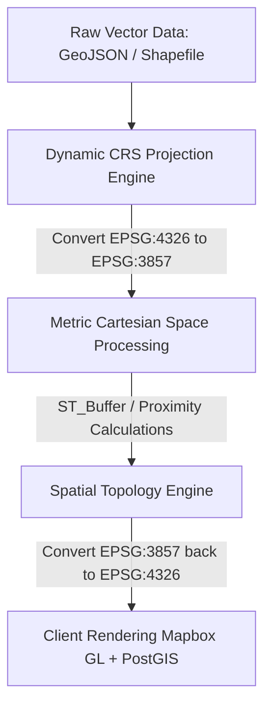
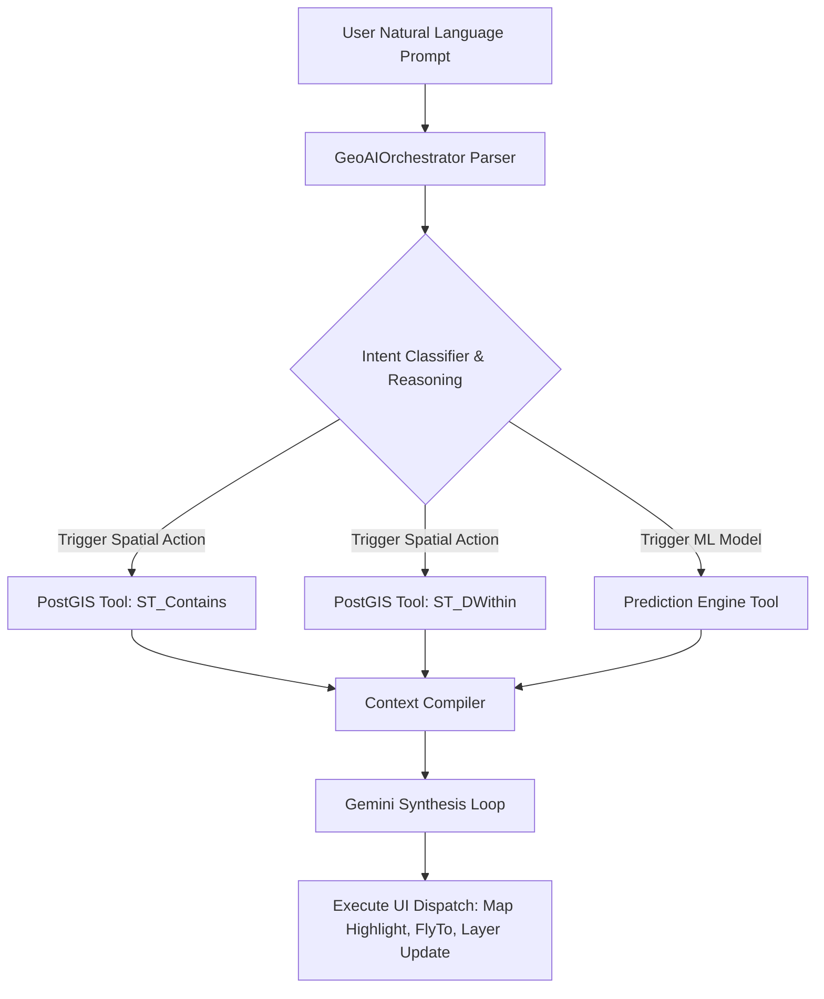

# GeoNarrative AI — Complete Project Understanding & Technical Blueprint
## 🌐 High-Performance Conversational GeoAI Digital Twin Platform
> **Specialization Focus:** Geospatial Intelligence (GI) · Machine Learning (AI) · Generative AI (GenAI) · Agentic AI (Autonomous Agents)  
> **Target Audience:** Technical Recruiters, Viva Defense Examiners, Research Collaborators, and System Architects

---

# SECTION 1 — PROJECT VISION & DIGITAL TWIN CONCEPT

**GeoNarrative AI** is an enterprise-grade, high-performance **Conversational GeoAI Digital Twin Platform**. It unifies standard Geographic Information Systems (GIS), predictive Machine Learning (AI), Large Language Model orchestration (GenAI), and autonomous action executors (Agentic AI) into a singular, beautiful, glassmorphic digital twin interface.

### The Real-World Disaster Crisis
Every year, climate disasters like urban flooding account for **over $40 billion in global damage**. Modern emergency response and city planning are severely hindered by data fragmentation:
* Spatial vectors sit isolated inside desktop software like ArcGIS.
* Meteorological data is locked behind independent APIs.
* Risk evaluation is performed manually on static spreadsheets.
* There is **no natural language interface** enabling a disaster manager, consultant, or municipal authority to intuitively query geospatial networks.

### The Conversational Digital Twin Solution
GeoNarrative AI bridges this divide by generating a real-time, WebGL-powered digital twin of a city. Users can ask questions in plain English (*"Show me hospitals within 500m of critical flood corridors"*), and the system executes real-time spatial joins, runs predictive algorithms, renders dynamic visual layers, and delivers natural language consulting reports.

```
                  ┌─────────────────────────────────────┐
                  │          GEONARRATIVE AI            │
                  │  Conversational Digital Twin Core   │
                  └──────────────────┬──────────────────┘
                                     │
         ┌───────────────────────────┼───────────────────────────┐
         ▼                           ▼                           ▼
  ┌──────────────┐            ┌──────────────┐            ┌──────────────┐
  │  GEOSPATIAL  │            │ PREDICTIVE   │            │ AUTONOMOUS   │
  │ INTELLIGENCE │            │   MODELS     │            │    AGENTS    │
  │ (PostGIS/    │            │ (XGBoost/    │            │ (LangChain/  │
  │ Mapbox/GDAL) │            │  LSTM/MCE)   │            │ Gemini/RAG)  │
  └──────────────┘            └──────────────┘            └──────────────┘
```

---

# SECTION 2 — THE GI (GEOSPATIAL INTELLIGENCE) PILLAR

For a Geospatial Intelligence specialist, the system’s primary strength lies in its **advanced vector pipelines, projections handling, database indexing, and Multi-Criteria Evaluation (MCE) engine**.



### 2.1 Coordinate Reference Systems (CRS) & Projection Safety
Geographic coordinates on the Earth’s surface are angular degrees defined by **WGS84 (EPSG:4326)**. Performing spatial operations like buffering directly on degree measurements introduces severe distortions because lines of longitude converge at the poles ($1^{\circ}$ of longitude is wider at the Equator than in Pune or New York).

GeoNarrative AI resolves this via dynamic **Projected CRS Reprojection**:
1. **Input Vectors:** Received as `EPSG:4326` (standard geodetic format for GeoJSON, KML, and GPS feeds).
2. **Dynamic Reprojection:** Project vectors to **Web Mercator (EPSG:3857)** using the flat metric plane.
3. **Spatial Computation:** Apply precise metric calculations:
   * *Flood Rivers Buffer:* $300\text{ meters}$ (`ST_Buffer(geom, 300)`)
   * *Traffic Congestion Corridor:* $150\text{ meters}$ (`ST_Buffer(geom, 150)`)
   * *Utility Service Ring:* $1.2\text{ kilometers}$ (`ST_Buffer(geom, 1200)`)
4. **Output Reprojection:** Reproject results back to `EPSG:4326` to ensure flawless rendering on WebGL-driven frontends (Mapbox GL JS standardizes on EPSG:4326 coordinate arrays in the form `[longitude, latitude]`).

### 2.2 PostGIS Spatial Database Architecture
Calculated geometries are stored inside a **PostgreSQL database optimized with the PostGIS extension**. Rather than performing slow $O(N)$ sequential table scans, PostGIS indexes geographic elements using **GiST (Generalized Search Tree) R-Tree** indexing:

* **Minimum Bounding Box (MBR):** PostGIS wraps complex geometry vectors (rivers, zones) into tight axis-aligned bounding boxes.
* **Balanced Regional Tree:** Groups overlapping MBRs hierarchically. High-speed spatial filters query only overlapping branches, pruning irrelevant data in $O(\log N)$ logarithmic complexity.

```sql
-- DDL Schema for Infrastructure and Flood Zones
CREATE EXTENSION IF NOT EXISTS postgis;

CREATE TABLE flood_zones (
    id SERIAL PRIMARY KEY,
    name VARCHAR(255) NOT NULL,
    risk_level VARCHAR(50) NOT NULL,
    geom GEOMETRY(MULTIPOLYGON, 4326)  -- Native spatial storage
);
CREATE INDEX idx_flood_zones_geom ON flood_zones USING GIST(geom); -- R-Tree Index

CREATE TABLE infrastructure (
    id SERIAL PRIMARY KEY,
    name VARCHAR(255) NOT NULL,
    type VARCHAR(100) NOT NULL,
    geom GEOMETRY(POINT, 4326)
);
CREATE INDEX idx_infrastructure_geom ON infrastructure USING GIST(geom);
```

### 2.3 Highly-Optimized Spatial Queries
Our repository executes native spatial functions directly in the database engine, avoiding memory overhead on the web server:

```sql
-- 1. Point-in-Polygon Containment: Find hospitals inside critical flood zones
SELECT infra.name, zone.name 
FROM infrastructure AS infra
JOIN flood_zones AS zone 
  ON ST_Contains(zone.geom, infra.geom)
WHERE infra.type = 'hospital';

-- 2. ST_DWithin Index Optimization: Find schools within 500m of a river
-- ST_DWithin performs index checks without generating circular buffer geometries
SELECT name 
FROM infrastructure 
WHERE type = 'school' 
  AND ST_DWithin(geom, 'SRID=4326;LINESTRING(73.8 18.5, 73.9 18.6)'::geometry, 0.0045); 
  -- 0.0045 degrees approx equals 500 meters at local latitude

-- 3. K-Nearest Neighbor (KNN) Search using '<->' Operator
-- ORDER BY geom <-> point uses GiST index bounding boxes for immediate O(log N) nearest neighbor search
SELECT name 
FROM infrastructure 
ORDER BY geom <-> 'SRID=4326;POINT(73.8567 18.5204)'::geometry 
LIMIT 5;
```

### 2.4 Hybrid MCE (Multi-Criteria Evaluation) Raster Engine
True location intelligence combines vector assets with continuous raster terrain files. GeoNarrative AI implements a computational **NumPy + Rasterio** raster evaluation grid:

1. **Grid Generation:** Spans a 100x100 spatial matrix across the city bounding box using a `rasterio.transform.from_bounds` affine projection.
2. **Terrain Simulation (DEM):** Models a continuous Digital Elevation Model where proximity to rivers registers as low-lying basins ($530\text{ meters}$) and heights increase linearly with distance ($+35\text{ m/km}$).
3. **Multi-Factor NumPy Overlay Math:**
   
   $$\text{Hazard Grid} = (W_1 \times \text{Proximity}) + (W_2 \times \text{ElevationNormalized}) + (W_3 \times \text{Rainfall}) + (W_4 \times \text{ImperviousSurface})$$
   
4. **Vectorization:** Converts high-hazard raster cells back into vector polygons using `rasterio.features.shapes` for immediate visual rendering.

---

# SECTION 3 — THE AI (MACHINE LEARNING) PILLAR

Beyond static database lookups, GeoNarrative AI integrates **multi-factor predictive models** to simulate and classify risk scores across different system modes.

```
       [Rainfall Intensity] ──► normalized [0.0 - 1.0] ──► x 30% ┐
       [Elevation Profile]  ──► normalized [0.0 - 1.0] ──► x 25% ├─► Weighted Sum
       [Zoning & Land Use]  ──► normalized [0.0 - 1.0] ──► x 20% ├─► (Score: 0.0-10.0)
       [Drainage Capacity]  ──► normalized [0.0 - 1.0] ──► x 15% │        │
       [Population Density] ──► normalized [0.0 - 1.0] ──► x 10% ┘        ▼
                                                                  [Risk Level Classifier]
                                                                  - Low    (< 4.0)
                                                                  - Medium (4.0 - 6.5)
                                                                  - High   (6.5 - 8.5)
                                                                  - Critical (> 8.5)
```

### 3.1 Normalization & Multi-Factor Mathematical Scoring
The prediction engine (`/api/v1/predict` endpoint) normalizes disparate inputs into standard indices:
* **Rainfall Index ($I_R$):** Upper-capped at $300\text{ mm}$ (critical standard):
  
  $$I_R = \min\left(\frac{\text{Rainfall}}{300}, 1.0\right)$$
  
* **Elevation Index ($I_E$):** Lower elevation yields higher risk (water flows downhill):
  
  $$I_E = \max\left(1 - \frac{\text{Elevation}}{1000}, 0.0\right)$$
  
* **Drainage Index ($I_D$):** Poor infrastructure drainage capacity increases risk:
  
  $$I_D = \max\left(1 - \frac{\text{Drainage Capacity}}{100}, 0.0\right)$$
  
* **Land-Use Coefficient ($C_L$):** Impervious concrete surfaces reduce ground absorption:
  
  $$C_L = \text{urban}~(0.8),~\text{suburban}~(0.5),~\text{rural}~(0.3),~\text{forest}~(0.1)$$

The global **Risk Score ($S_R$)** scales from $0.0$ to $10.0$:

$$S_R = 10 \times \left(0.30 \cdot I_R + 0.25 \cdot I_E + 0.20 \cdot C_L + 0.15 \cdot I_D + 0.10 \cdot I_{\text{density}}\right)$$

### 3.2 Machine Learning Multi-Mode Pipeline
The system maps domain-specific modeling techniques to each operational mode:

| Mode | Simulated Predictive Model | Critical Features Assessed | Real-World Target |
| :--- | :--- | :--- | :--- |
| **🌊 Flood** | **XGBoost Classifier** | Rainfall, DEM elevation, Land cover, Soil drainage | Inundation risk & hazard index |
| **🚗 Traffic** | **LSTM Network** | Road volume/capacity ratio, Signal timing, Incidents | Congestion index & bottlenecks |
| **🏗️ Urban** | **Zoning Decision Forest** | Growth rates, Permits, Infrastructural headroom | Spatial compliance & expansion pressure |
| **⚡ Utility** | **Grid Failure Random Forest**| Asset age, Thermal stress, Load capacity, Redundancy | Substation outages & consumer isolation |

---

# SECTION 4 — THE GENAI (GENERATIVE AI) PILLAR

GeoNarrative AI implements a modular, high-security **Generative AI pipeline** supporting document Q&A and contextual reporting using LLMs (e.g., Google Gemini).

```
   ┌─────────────────────────────────────────────────────────────┐
   │                  SPATIAL RAG PIPELINE                       │
   └──────────────────────────────┬──────────────────────────────┘
                                  │
      ┌───────────────────────────┴───────────────────────────┐
      ▼ (Unstructured Data)                                   ▼ (Spatial Vector Files)
┌──────────────┐                                        ┌──────────────┐
│ PDF Reports  │                                        │ GeoJSON/SHP  │
│ Land Laws    │                                        │ Attributes   │
└──────┬───────┘                                        └──────┬───────┘
       │                                                       │
       ▼ [Google text-embedding-004]                           ▼ [Spatial Properties Ingest]
┌──────────────┐                                        ┌──────────────┐
│ Vector Embed │                                        │ Spatial      │
│ (768 Dim)    │                                        │ Attributes   │
└──────┬───────┘                                        └──────┬───────┘
       │                                                       │
       └───────────────────────────┬───────────────────────────┘
                                   ▼
                       ┌───────────────────────┐
                       │   pgvector Database   │
                       │   (Hybrid Search)     │
                       └───────────────────────┘
```

### 4.1 Retrieval-Augmented Generation (RAG) for GIS
 RAG combines Large Language Models with private databases. Our spatial RAG framework addresses two distinct data streams:
1. **Unstructured Documents:** PDFs (zoning master plans, environmental regulations) are chunked and vectorized using Google's `text-embedding-004` (768 dimensions).
2. **Geospatial Files:** User-uploaded GIS vector layers (GeoJSON, Shapefile, KML) are parsed. The feature attributes, topology logs, coordinate ranges, and geographic headers are converted into structured contextual dictionaries.

When a query is received, the RAG engine performs a **Hybrid Geospatial Vector Search**:
$$\text{Relevance} = \alpha \cdot \text{CosineSimilarity}(\mathbf{V}_{\text{query}}, \mathbf{V}_{\text{doc}}) + (1-\alpha) \cdot \text{SpatialOverlap}(\text{QueryBuffer}, \text{DocBounds})$$
This ensures that environmental laws are retrieved *only* if they apply to the exact geographic boundary (ST_Contains/ST_DWithin) of the user's focus area.

### 4.2 Prompt Engineering & Persona Control
To guarantee professional outputs, system instructions lock the LLM into a highly analytical persona:

```
[SYSTEM INSTRUCTION: GEOSPATIAL INTELLIGENCE CORE ENGINE]
You are acting as a Senior Geospatial AI Consultant. You do not offer conversational filler or generic warnings. 
You must analyze all provided PostGIS queries and prediction matrices inside the <CONTEXT> tags using real spatial terminology:
- Cite precise geographic coordinates in EPSG:4326 projection.
- Always output a Markdown table summarizing risk scores (0-10) and affected infrastructure.
- Provide a dedicated 'GIS Engineering Methodology' section explaining spatial buffering values, coordinate reprojections, and weighted factor scoring models.
```

---

# SECTION 5 — THE AGENTIC AI PILLAR

The conversational interface of GeoNarrative AI is not a static chatbot; it is powered by an **Agentic AI Orchestration Layer** based on the **ReAct (Reasoning and Acting)** framework.



### 5.1 LangChain Architectural Principles
The orchestrator (`GeoAIOrchestrator`) manages complex multi-step reasoning:
* **Spatial Tool Routing:** Instead of asking the LLM to write code or guess spatial data, the orchestrator parses natural language (e.g., *"Highlight vulnerable schools"*), maps it to a designated **Spatial Tool** (e.g., executing `PostGIS ST_DWithin`), retrieves the exact geographic records, and passes the clean context back to the LLM.
* **Conversation Buffer Window Memory:** Maintains a sliding window of historical turns to keep memory clean, geolocating and adjusting user queries contextually while discarding bloated coordinate arrays to avoid token limits.
* **Autonomous UI Actions (Dispatching):** The agent generates structured responses that contain **UI command payloads** (e.g., `{ "action": "flyTo", "coordinates": [73.8567, 18.5204], "zoom": 14 }`). The frontend intercepts this payload, prompting Mapbox to execute panning, zooming, and highlighting actions.

---

# SECTION 6 — UNIFIED END-TO-END DATA JOURNEY

Here is how a natural language request (*"Check school vulnerability near the river after 250mm of rainfall"*) travels through the system:

```
┌─────────────────────────────────────────────────────────────────────────────────────────────┐
│ 1. Frontend: User inputs query. TopNav geocodes location to Pune coordinates.               │
└──────────────────────────────────────────────┬──────────────────────────────────────────────┘
                                               ▼
┌─────────────────────────────────────────────────────────────────────────────────────────────┐
│ 2. Backend: /api/v1/chat endpoint intercepts request. GeoAIOrchestrator evaluates intent.   │
└──────────────────────────────────────────────┬──────────────────────────────────────────────┘
                                               ▼
┌─────────────────────────────────────────────────────────────────────────────────────────────┐
│ 3. Tool Routing: Routing logic triggers local PostGIS / shapely school proximity query.     │
└──────────────────────────────────────────────┬──────────────────────────────────────────────┘
                                               ▼
┌─────────────────────────────────────────────────────────────────────────────────────────────┐
│ 4. Prediction Run: Weighted ML engine evaluates risk: Rainfall(250mm) + Elevation(540m)      │
│    yields score 8.7/10 (CRITICAL).                                                          │
└──────────────────────────────────────────────┬──────────────────────────────────────────────┘
                                               ▼
┌─────────────────────────────────────────────────────────────────────────────────────────────┐
│ 5. Context Compilation: Bundles PostGIS query records + ML risk scores into a clean context.│
└──────────────────────────────────────────────┬──────────────────────────────────────────────┘
                                               ▼
┌─────────────────────────────────────────────────────────────────────────────────────────────┐
│ 6. LLM Synthesis: Gemini processes context under strict system persona. Generates report.   │
└──────────────────────────────────────────────┬──────────────────────────────────────────────┘
                                               ▼
┌─────────────────────────────────────────────────────────────────────────────────────────────┐
│ 7. Client Render: Markdown tables compile into styled components. Map highlights flood    │
│    corridor & flashes vulnerable school points with pulsing CSS rings.                      │
└─────────────────────────────────────────────────────────────────────────────────────────────┘
```

---

# SECTION 7 — PLACEMENT, VIVA, & RECRUITER PREPARATION CARD

Use this quick-reference guide during interviews or academic defense to confidently explain the architectural design decisions of your platform:

### 💡 Core Architectural Questions & Answers

#### Q1: Why did you choose Next.js and FastAPI instead of a monolithic system?
> **Answer:** "I decoupled the architecture to maximize performance and separation of concerns. Next.js 14 handles the Presentation Layer, utilizing dynamic imports with `ssr: false` to securely load WebGL Mapbox GL JS libraries which rely on browser window objects. FastAPI serves as our API Gateway, leveraging native asynchronous ASGI event loops (via Uvicorn and `httpx`) to perform non-blocking API calls and spatial processing. Pydantic models guarantee strict request/response validation, auto-generating our Swagger `/docs` schema."

#### Q2: How does the platform scale from a local demo to a production enterprise SaaS?
> **Answer:** "The scaling strategy has three pillars:
> 1. **Data Layer:** Transition from our in-memory cache to a physical PostgreSQL instance optimized with the PostGIS extension, indexing all geometries using GiST R-Trees.
> 2. **AI/ML Pipelines:** Deploy real XGBoost/LSTM models in Docker containers, and implement a vector search engine (like pgvector or Pinecone) to host document embeddings for the RAG pipeline.
> 3. **Orchestration:** Wrap python routines into decoupled microservices deployed in Docker containers managed by Kubernetes, using Redis to cache frequent geospatial coordinate queries."

#### Q3: What is the coordinate reference system of your map, and what projection bug did you actively design against?
> **Answer:** "Our map utilizes **EPSG:4326 (WGS84)** for spatial API communications, conforming to standard GeoJSON specifications where coordinate values follow `[longitude, latitude]` order. However, performing distance buffers directly in angular degrees is a severe spatial bug because it introduces geographic distortion. I designed around this by reprojecting vectors dynamically into a metric projected Coordinate Reference System (**EPSG:3857 - Web Mercator**), executing accurate metric buffering, and then reprojecting back to WGS84 for WebGL frontend mapping."

#### Q4: Explain the difference between WKT, WKB, and EWKB formats.
> **Answer:** "WKT (Well-Known Text) is a human-readable string representation of geospatial shapes (e.g., `POINT(73 18)`), perfect for SQL scripts and debugging. WKB (Well-Known Binary) is a standard byte array that eliminates float parsing overhead for databases. EWKB (Extended Well-Known Binary) is a PostGIS extension that adds SRID spatial metadata directly into the binary header, ensuring coordinate reference system consistency across our database storage blocks."

---
> **DOCUMENT SUMMARY:** This technical masterclass blueprint acts as a comprehensive reference guide for the Conversational GeoAI Digital Twin Platform. It details the exact mathematical models, spatial relational designs, and system architectures that elevate GeoNarrative AI to an enterprise-grade solution.
