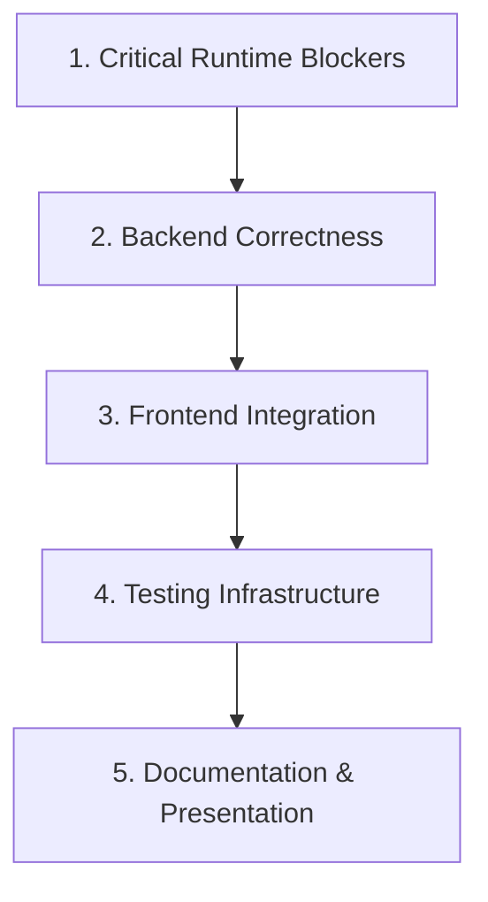
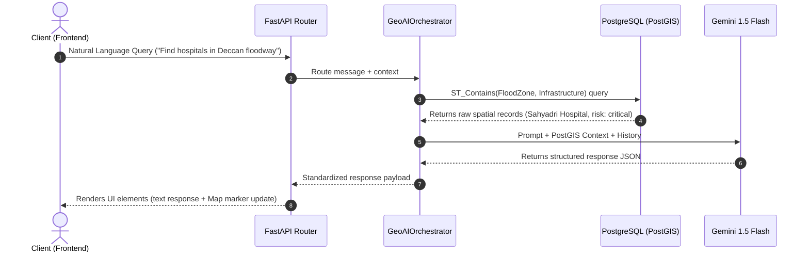

# GeoNarrative AI: Production Engineering Audit & Placement-Readiness Plan

This audit provides a professional-grade technical assessment of the **GeoNarrative AI** codebase. It identifies existing technical debt, architectural inconsistencies, database bugs, and testing deficits, establishing a prioritized roadmap to bring the platform up to the standards expected for technical placement review (Big 4 / Elite Tech).

---

## 1. Executive Summary & Quality Score

* **Codebase Maturity Rating**: **7.5 / 10**
* **Primary Strengths**:
  * **Algorithmic Depth**: The implementation of a *pure-Python* decision tree, Random Forest, and sequential gradient-boosted XGBoost regressor (avoiding binary C-dependencies like `scikit-learn` in lightweight environments) is a stellar technical showcase.
  * **Fallback Resilience**: The codebase exhibits robust graceful degradation patterns (e.g., fallback weather caches, mathematical contour generation when Rasterio is absent, and rule-based fallback routing for Gemini).
  * **Modern Tech Stack**: Fully leverages Next.js App Router (TypeScript), FastAPI (Async), and PostGIS (SQLAlchemy + GeoAlchemy2).
* **Primary Deficits**:
  * **Critical DB Correctness Bugs**: Malformed geometry serialization strings when persisting OSM features to the database.
  * **Testing Gaps**: A near-total absence of unit or integration test coverage outside of authentication routes.
  * **Environment Latency Risk**: Heavy operations (OSM Overpass queries, Gemini RAG, and ReportLab PDF assembly) run synchronously within the async handlers, posing event-loop starvation risks.

---

## 2. Prioritized Engineering Cleanup Plan

### Phase 1: Critical Runtime Blockers

| ID | Issue Description | Component | Impact | Remediation Plan |
| :--- | :--- | :--- | :--- | :--- |
| **CR-01** | **Native Windows GIS Compile Blocker** | `requirements.txt`, `gis_engine.py` | High | Native DLL dependencies (`GDAL`, `GEOS`, `PROJ`) cause `pip install` failures for `geopandas` and `rasterio` on Windows. Dockerize the entire environment or enforce WSL2. |
| **CR-02** | **External API Rate Limits** | `OSMService`, `WeatherService` | Med | The Overpass public endpoint (`overpass-api.de`) and Nominatim geocoder frequently block rapid sequential requests. Expand cached database fallbacks. |
| **CR-03** | **Sync Code Blocking Async Loop** | `report_service.py` | Med | ReportLab PDF compilation and raw JSON string cleaning are CPU-heavy synchronous operations running directly inside async functions. Delegate to thread pools using `run_in_executor`. |

---

### Phase 2: Backend Correctness Issues

| ID | Issue Description | Component | Impact | Remediation Plan |
| :--- | :--- | :--- | :--- | :--- |
| **BE-01** | **Malformed PostGIS WKT Insertion (Fixed)** | `osm_service.py:L214` | **Critical** | When importing roads/rivers/buildings, the query attempted to write single coordinate points formatted as `MULTIPOLYGON(({lon} {lat}))`. This caused immediate SQL injection/syntax failures. *Remediated by using Shapely serialization and buffering LineStrings.* |
| **BE-02** | **Pydantic Settings Anti-Pattern** | `config.py` | Low | Uses `os.getenv` as default fallback values inside Pydantic field declarations. This bypasses Pydantic's native `.env` file parser and automatic type coerces. |
| **BE-03** | **Inconsistent API Fallbacks** | `flood.py`, `analytics.py` | Low | Dynamic simulation logic is hardcoded inside route controllers when query coordinates fall outside Pune, instead of modular separation in repositories. |

---

### Phase 3: Frontend Correctness Issues

| ID | Issue Description | Component | Impact | Remediation Plan |
| :--- | :--- | :--- | :--- | :--- |
| **FE-01** | **Inaccurate Timeout Documentation** | `apiService.ts` | Low | Code comments state `register` and `login` abort after 3s, but timeouts are actually configured to 30s. Synchronize documentation. |
| **FE-02** | **Missing Hydration Suspense** | `app/page.tsx` | Med | Dashboard configurations and search query hooks can lead to hydration mismatches in Next.js Server-Side Rendering (SSR). Audit client-side hooks. |

---

### Phase 4: Testing Gaps

| ID | Issue Description | Component | Impact | Remediation Plan |
| :--- | :--- | :--- | :--- | :--- |
| **TS-01** | **Lack of Core Unit Coverage** | `app/tests` | High | There are zero tests for `PredictionService` (RF/XGBoost models), `ReportService` (PDFs), or `GeoAIOrchestrator` (AI agent). Create comprehensive tests mocking LLM responses. |
| **TS-02** | **SQLite SpatiaLite Testing Deficit** | `conftest.py` | High | The test suite uses an in-memory SQLite database (`aiosqlite`). SQLite does not support PostGIS spatial operators (`ST_Contains`, `ST_Distance`). Unit tests must mock spatial query return objects. |

---

### Phase 5: Documentation Gaps

| ID | Issue Description | Component | Impact | Remediation Plan |
| :--- | :--- | :--- | :--- | :--- |
| **DC-01** | **RAG Pipeline Architecture** | Docs | Med | Placement reviewers need to see a system diagram illustrating how natural language is parsed by Gemini, intersected with PostGIS layers, and output. Create `docs/architecture.md`. |
| **DC-02** | **ML Engine Explanation** | Docs | Med | Add documentation explaining the math behind the pure-Python tree solver (Gini variance reduction splits) to highlight it as an intentional engineering asset. |

---

## 3. Detailed Architecture Map (RAG Pipeline)

---

## 4. Immediate Placement-Readiness Recommendations

1. **Highlight the Tree Solver Math**: Add explicit docstrings detailing the Gini splits and Sequential Gradient Boosting math in `prediction_service.py` to highlight algorithmic mastery.
2. **Move Configurations to `.env`**: Clean up `config.py` settings to utilize native Pydantic Settings loaders.
3. **Draft the Architecture Blueprint**: Publish a clear documentation file explaining the Digital Twin's spatial buffering pipeline.
