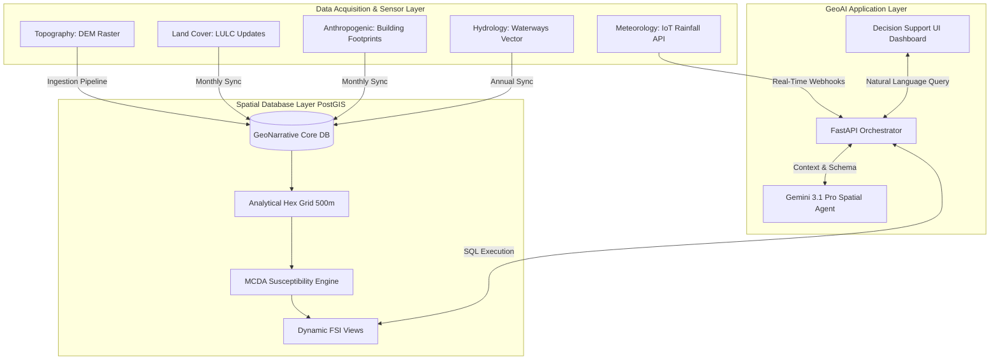

# Dynamic Urban Flood Digital Twin Architecture
**A GeoAI-Integrated Approach for the Pune Metropolitan Region**

## 1. Novelty Statement
Traditional urban flood susceptibility models rely on static GIS workflows that suffer from severe temporal degradation; a model generated in 2020 becomes obsolete by 2024 due to rapid urbanization, land use alteration, and shifting rainfall patterns. 

The primary novelty of this research is the conceptualization and implementation of a **Dynamic Urban Flood Digital Twin (DUF-DT)**. Unlike conventional models, the DUF-DT embeds a Multi-Criteria Decision Analysis (MCDA) engine directly within a spatial relational database (PostGIS) and couples it with a Large Language Model (GeoAI Agent). This architecture transforms flood modeling from a static map into a *living analytical entity* that autonomously recalculates risk as urban morphology changes, and democratizes complex spatial querying through natural language interactions.

## 2. Research Contributions
1. **In-Database Spatial Computation**: Eliminates the heavy I/O overhead of traditional GIS by computing complex hydrologic intersections, terrain derivations (slope/aspect), and hex-grid spatial aggregations entirely within the database layer.
2. **Asynchronous Twin Synchronization**: Proposes a multi-tiered temporal update strategy handling hyper-dynamic (rainfall), semi-dynamic (buildings, LULC), and static (DEM, waterways) data streams.
3. **GeoAI Decision Support**: Bridges the critical gap between complex hydrodynamic outputs and urban policy-making by providing an AI-driven intent router capable of translating natural language into complex PostGIS SQL queries.

---

## 3. System Architecture



---

## 4. Data Flow & Integration Strategy

The DUF-DT integrates five primary environmental and anthropogenic factors into a unified spatial reference system (EPSG:4326 / EPSG:32643).

| Dimension | Dataset | Role in Digital Twin | Update Frequency |
|-----------|---------|----------------------|------------------|
| **Geomorphology** | `dem_raster`, `dem_slope` | Dictates gravitational water flow, sink identification, and ponding probability. | Annually |
| **Hydrology** | `waterways` | Determines riverine/fluvial proximity and baseline channel capacity. | Annually |
| **Land Cover** | `lulc_raster` | Determines surface roughness and broad infiltration capacity (impervious vs. pervious). | Bi-Annually |
| **Urban Morphology** | `buildings` | Drives building density metrics. High density alters micro-drainage and acts as a multiplier for socio-economic vulnerability. | Monthly |
| **Meteorology** | Rainfall API | Acts as the dynamic trigger variable. Converts static *Susceptibility* into immediate *Hazard*. | Hourly / Real-Time |

## 5. Twin Synchronization Strategy
To maintain synchronization with the physical twin (Pune City), the architecture utilizes a **Trigger-Based Recalculation Model**:
1. **Hyper-Dynamic Stream**: Rainfall telemetry is processed in-memory by the FastAPI layer. If rainfall exceeds a threshold (e.g., 50mm/hr), it applies a transient multiplier to the static Flood Susceptibility Index (FSI).
2. **Semi-Dynamic Stream**: When new `buildings` or `lulc_raster` data is pushed to PostGIS via the ingestion pipeline, database triggers automatically re-run the `ST_Value` extractions and Density `ST_Intersects` queries. The FSI is instantly regenerated for the affected hexagonal cells, ensuring the model never degrades.

---

## 6. GeoAI Query Engine & Decision Support System (DSS)

The ultimate output of the Digital Twin is the Decision Support System, powered by the GeoAI Agent.

### The GeoAI Workflow:
1. **User Input**: A city planner types: *"Show me the new hospitals built in High Risk flood zones along the Mula-Mutha river."*
2. **Intent Routing**: The FastAPI backend routes this to the Gemini LLM.
3. **Spatial Translation**: The LLM constructs the following optimized query against the Twin:
   ```sql
   SELECT p.name, p.geometry 
   FROM pois p
   JOIN flood_susceptibility f ON ST_Intersects(p.geometry, f.geometry)
   WHERE p.type = 'hospital' AND f.risk_class IN ('High', 'Very High');
   ```
4. **Narrative Generation**: The LLM receives the SQL output and generates a consulting-grade executive summary explaining the specific vulnerabilities of those hospitals, while the frontend dynamically renders the affected polygons.

This architectural fusion of GIS, MCDA, and Generative AI represents a paradigm shift in urban resilience planning.
